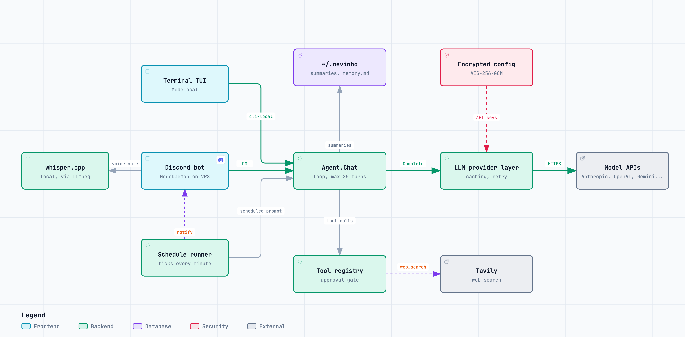
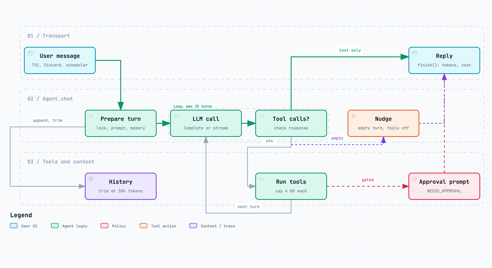

# Architecture

How nevinho is laid out, how a message flows through it, and how the context window stays small.

The same agent core powers two transports. The Discord bot runs on a VPS and serves the owner over DMs. The TUI runs locally and talks to the same agent over the terminal. On the VPS, a schedule runner is a third caller. Everything below the transport boundary is shared.

---

## System Overview



```
   Local terminal (TUI)        VPS daemon (Discord + scheduler)
   --------------------        --------------------------------
   nevinho                     nevinho start
        \                            /
         \                          /
          v                        v
        +----------------------------+
        |  Agent.Chat(userID, text)  |
        |  one core, three callers   |
        |   . per-user lock          |
        |   . cancellable context    |
        |   . approval gate          |
        |   . loop, max 25 turns     |
        +-------------|--------------+
                      v
        +----------------------------+
        |  Context window            |
        |  [system prompt] (cached)  |
        |  [tool defs]     (cached)  |
        |  [summary preamble]        |
        |  [user/assistant/tool msgs]|
        |  budget: 30k tokens        |
        +-------------|--------------+
                      v
        +----------------------------+
        |  LLM provider              |
        |  anthropic / openai /      |
        |  gemini / groq /           |
        |  openrouter / ollama       |
        +----------------------------+
                      |
                      v
        +----------------------------+
        |  Tool registry             |
        |   . bash (2m timeout)      |
        |   . file_read/write/edit   |
        |   . web_search / web_read  |
        |   . find / grep / file_list|
        |   . schedule (daemon only) |
        |   . approval flow          |
        +----------------------------+
```

---

## Two Transports, One Core

`agent.Agent` does not know it is talking to a terminal or a chat client. The transport handles I/O and approvals. The agent handles the loop.

The only thing that differs is `RunMode`, set when the agent is constructed.

- `ModeLocal` is for the TUI. Strict approvals. Every bash command and every write outside the cwd needs a yes. The system prompt tells the model it is running on the user's own machine.
- `ModeDaemon` is for Discord on a VPS. Same approval mechanism but with a longer trust list for the owner. System prompt tells the model it is the owner's remote assistant.

Both modes pass the same `userID` through `Chat()`. Local always uses `cli-local`. Discord uses the Discord user ID. Per-user state (history, locks, pending approvals) is keyed by this string.

### The scheduler

In daemon mode, `schedule.Runner` ticks once a minute and fires due jobs through `Agent.ChatScheduled`. Each job runs under its own `scheduler:<id>` user, so its history never mixes with the owner's chat. The history is cleared before every run, and the result is sent to the owner as a Discord DM. Jobs live encrypted in `~/.nevinho/schedules.enc`.

### Capabilities

Every turn carries an `ExecContext` with a source and a capability set. The registry only runs a tool whose capability is in that set.

| Source        | Capabilities                                              |
| ------------- | --------------------------------------------------------- |
| `interactive` | net.read, fs.read, fs.write, shell.exec, schedule.mut     |
| `scheduled`   | net.read, fs.read                                         |

Scheduled runs are read-only on purpose. A job cannot run bash, write files, or create more jobs.

### Voice and images

Discord only. A voice note is downloaded, converted to WAV with ffmpeg, and transcribed by a local whisper.cpp binary (`voice/`). The transcript reaches `Chat()` as plain text with `isVoice` set, which only changes how it is logged. `nevinho setup` downloads the whisper binary and model. Image attachments are passed to `Chat()` as `llm.Image` values.

---

## The Agentic Loop

This is the heart of `agent.Chat()`. One user message can trigger many LLM calls as the model uses tools.



```
User sends message
    |
    v
pending approval? yes runs the held call, no drops it
    |
    v
build system prompt (+ memory.md, cwd, home)
    |
    v
appendHistory(user message)
    |. maxHistoryTokens exceeded? trim oldest, summarize evicted
    |
    v
+--[LOOP start, max 25 iterations]--+
|                                    |
|  ctx cancelled? return             |
|         |                          |
|         v                          |
|  Complete / StreamComplete(        |
|    system prompt, history,         |
|    tool defs allowed by caps       |
|  )                                 |
|         |                          |
|         v                          |
|  appendHistory(assistant reply)    |
|         |                          |
|         v                          |
|  no tool calls? return text        |
|         |                          |
|  has tool calls:                   |
|    for each call:                  |
|      . emit ToolStart event        |
|      . execute via registry        |
|      . cap result at 4 KB          |
|      . emit ToolDone event         |
|         |                          |
|         v                          |
|  appendHistory(tool results)       |
|         |                          |
|         v                          |
|  needs approval? return early      |
|         |                          |
|  next iteration ---> LOOP          |
|                                    |
+------------------------------------+
```

Every terminal path in `Chat()` goes through `finish()`. That is where token accounting, logging, and the final reply assembly live. If the model ends a turn with neither text nor a tool call (Gemini does this after a tool loop), `nudgeForReply()` runs one more completion with tools off so the user always gets a reply.

---

## Context Engineering

Every token entering the context window has to earn its place. Four mechanisms enforce this.

### 1. Prompt caching

System prompt and tool definitions are marked with `cache_control: ephemeral` on providers that support it. Turns 2+ reuse the cached prefix instead of re-tokenizing ~900 tokens.

Savings show up as `cache_read_input_tokens` in the response and feed the `/status` cost line.

### 2. Tool result capping

Every tool output is truncated before it enters history.

```
Tool layer:    bash output capped at ~8 KB
               file_read capped at 100 KB on disk, less in history
               web_read capped at ~8 KB

Agent layer:   all tool results capped at 4 KB before history
```

This stops one `cat` or one page fetch from bloating every future turn.

### 3. Token-aware history trimming

History is bounded by `maxHistoryTokens` (30k), not by message count.

```
appendHistory(new message)
    |
    v
estimateTokens(history) > 30,000?
    |
    no -> done
    |
    yes -> trimHistoryByTokens:
             1. find earliest index where remaining msgs fit the budget
             2. walk forward to a clean boundary:
                . skip orphaned tool results
                . skip orphaned assistant messages
                . skip tool_use array messages
                . land on a plain user message
             3. return msgs[start:]
```

Estimation is `len(json_bytes) / 4` per message. Rough but consistent. Off by 20% just means trimming a little earlier or later.

### 4. Summarize on trim

Evicted messages do not just vanish. The agent asks the LLM to summarize them in 2 to 3 sentences and prepends that summary to history. About 200 output tokens once, in exchange for context that would otherwise be lost.

---

## Persistence (Elephant)

When `ELEPHANT` is on (the default, override with `ELEPHANT=off`), the agent writes a summary of each active user's history to disk on shutdown. On next start the summary loads back so the conversation resumes with context intact.

Files live in `~/.nevinho/summaries/<userID>.md`. `/session` in the TUI dumps the current summary.

Schedules live in `~/.nevinho/schedules.enc`, encrypted like the config. Every write to disk goes through `safeio.WriteFile` (temp file, fsync, rename), so a crash mid-write leaves the old file or the new one, never a truncated mix.

User preferences detected from corrections (the model picking up "always", "never", "remember") are stored separately in `~/.nevinho/memory.md` and survive `/forget`. `/memory` in the TUI dumps them.

---

## Concurrency

```
Agent (shared)
  |
  +. mu (sync.Mutex): history, userLock, cancelFn, pendingToolID
  |
  +. userLock[userID]: one mutex per user, serializes Chat() calls
  |
  +. cancelFn[userID]: per-user cancellation via context
```

Different users run in parallel. The same user's messages serialize so no interleaving inside one conversation. `Cancel(userID)` calls the stored cancel function, which the loop checks each iteration.

---

## Approval Flow

```
Tool execution
    |
    v
Path or command needs approval?
    |.. no -> execute, return output
    |
    |.. yes -> store Pending{Kind, Detail} on the registry
               return "NEEDS_APPROVAL: <reason>"
               agent returns the prompt as its reply
               user replies yes or no
               next Chat() call detects the pending state:
                 . approval words -> execute, replace placeholder result
                 . denial words   -> clear pending, tell model to move on
```

Approved paths persist in `~/.nevinho/approved_paths.json`. `/paths` in the TUI lists them and lets you revoke one. `/paths clear` wipes the lot.

In `ModeLocal`, every bash command goes through this gate. In `ModeDaemon`, only dangerous patterns (rm, sudo, curl-piped-to-shell, and similar) trip it.

---

## TUI Rendering

The TUI uses Bubble Tea but does not enter the alternate screen. Conversation blocks are pushed straight into the terminal's regular scrollback with `tea.Println`. The terminal handles wheel scroll, text selection, and URL clicking natively, the same way Claude Code and opencode do it.

Only the live region at the bottom (input box, working line, status bar, pickers) is managed by Bubble Tea. Blocks stretch the full terminal width.

The agent talks to the TUI over two buffered channels. Neither ever blocks the agent: a full channel drops the value.

- Tool events (capacity 64). The TUI prints a card per `ToolDone` event.
- Stream deltas (capacity 256). The TUI calls `ChatStream`, and text deltas render live in the working region. When the turn ends, the full reply is printed to scrollback as one block, and the status bar shows how long the turn took.

Providers that implement `llm.StreamingProvider` stream. Others fall back to a plain `Complete` call. Discord never streams.

---

## What Enters the Context Window

```
+--------------------------------------------------+
| System prompt             ~220 tokens   (cached) |
| Tool definitions          ~680 tokens   (cached) |
|--------------------------------------------------|
| [Summary preamble]        50 to 100 tokens       |
| User message 1            variable               |
| Assistant reply 1         variable               |
| User message 2 (tools)    variable               |
| Tool results              variable, capped 4 KB  |
| ...                                              |
| Latest user message       variable               |
|--------------------------------------------------|
| maxHistoryTokens          ~30,000 tokens         |
| Max output                4,096 tokens           |
+--------------------------------------------------+
```

The cached prefix (~900 tokens) is essentially free after the first turn. The rest is the sliding window of the conversation.

---

## Constants

| Name | Value | Purpose |
|------|-------|---------|
| `maxOutputTokens` | 4,096 | Max output tokens per LLM call |
| `maxLoops` | 25 | Max tool-call iterations per `Chat()` |
| `maxHistoryTokens` | 30,000 | Token budget for conversation history |
| `maxToolResult` | 4,000 | Max bytes per tool result in history |
| `chatTimeout` | 5 min | Whole-turn timeout |
| `bashTimeout` | 120 s | Bash command timeout |
| `httpTimeout` | 15 s | Web tool HTTP timeout |
| `RunTimeout` | 5 min | Scheduled run timeout |

---

## Package Map

```
nevinho/
  main.go                CLI entry point. nevinho with no args launches the TUI.
  cmd/
    chat.go              nevinho chat. Same as no-arg launch.
    serve.go             Discord daemon. Wires the bot, agent, and
                         schedule runner.
    service.go           nevinho start/stop/status/logs. systemd unit.
    config.go            nevinho config get/set/clear.
    upgrade.go           nevinho upgrade. Self-update.
    uninstall.go         nevinho uninstall.
    version.go           nevinho version.
  agent/
    agent.go             Agent struct, constructors, public API (Model,
                         SwitchModel, SetConfig, Usage, AvailableModels,
                         Status, RevokePath, and others).
    loop.go              Chat(), ChatStream(), ChatScheduled(), the
                         agentic loop, approval handshake, tool
                         execution, nudgeForReply.
    history.go           appendHistory, trimHistoryByTokens,
                         summarizeAndPrepend, MemoryView, SummaryView,
                         ClearHistory.
    persistence.go       Per-user summary path helpers, sanitization.
  llm/
    provider.go          Provider and StreamingProvider interfaces,
                         message types, stop reasons.
    anthropic.go         Anthropic Messages API plus prompt caching.
    openai.go            OpenAI chat completions (plus Ollama via the
                         compatible endpoint).
    gemini.go            Gemini generateContent. Tool results go in
                         user-role contents, not function-role.
    errors.go            FriendlyError. Maps provider error codes to
                         human text.
    http.go              Shared HTTP client with retry.
    image.go             Base64 image helpers.
  tools/
    registry.go          Tool dispatch, approval bookkeeping,
                         approved-path persistence.
    capabilities.go      ExecContext, sources, capability presets.
    bash.go              Shell execution and danger pattern detection.
    file.go              file_read/write/edit/list with path sandboxing.
    find.go, grep.go     Code search.
    web.go               Tavily search and page fetch.
    schedule.go          schedule tool: create, list, delete jobs
                         (daemon only).
  tui/
    tui.go               Bubble Tea model, inline rendering, slash
                         commands, pickers.
    blocks.go            Render of user, agent, hint, error, approval,
                         and tool blocks.
    selector.go          Filterable picker. Backs /model, /config,
                         /paths.
    files.go             File list for @ mentions (git ls-files).
    theme.go             Colour palette and styles.
  discord/
    bot.go, messages.go  Discord session, message handling.
    format.go            Markdown and message splitting for Discord.
    commands.go          Slash commands.
    indicator.go         Typing indicator while a turn runs.
    attachments.go       Image and voice handling.
  config/
    config.go            Encrypted config with env/file/runtime layers.
    models.go            Known model catalog per provider.
    setup.go             Interactive `nevinho setup` wizard.
  crypto/
    crypto.go            AES-256-GCM for the config store.
  logger/
    logger.go            Coloured terminal output for the daemon.
  memory/
    memory.go            User preference detection and storage.
  safeio/
    safeio.go            Atomic file writes (temp, fsync, rename).
  schedule/
    schedule.go          Encrypted job store, run log.
    cron.go              Cron parsing with timezones.
    runner.go            Ticks every minute, fires due jobs, notifies.
  voice/
    transcribe.go        ffmpeg to WAV, then local whisper.cpp.
    setup.go             Downloads the whisper binary and model.
  assets/diagrams/       Diagram PNGs and their Archify JSON sources.
```
