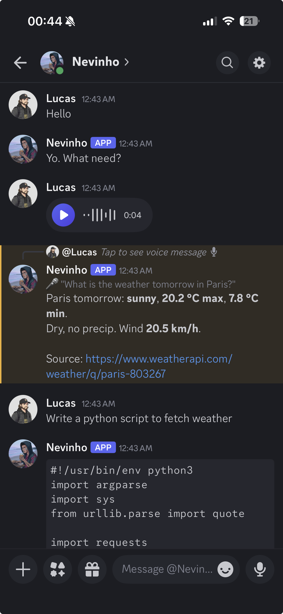
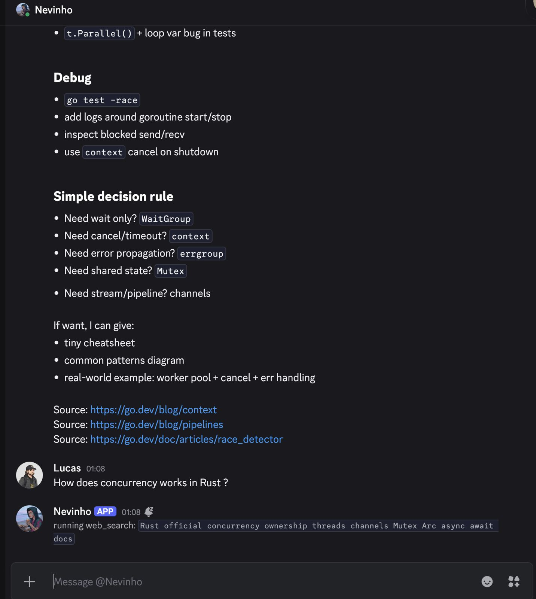

<p align="center">
  
</p>

<h1 align="center">nevinho</h1>

<p align="center"><i><b>
A personal AI agent you self-host. Reach it from a Discord DM, or run it as a coding agent in your terminal.
</b></i></p>

<p align="center">
  <a href="https://github.com/lucasnevespereira/nevinho/stargazers"></a>
  <a href="https://github.com/lucasnevespereira/nevinho/network/members"></a>
  <a href="https://github.com/lucasnevespereira/nevinho/issues"></a>
  <a href="https://github.com/lucasnevespereira/nevinho/releases"></a>
  <a href="LICENSE"></a>
</p>

Supports Anthropic, OpenAI, Gemini, Groq, OpenRouter, and Ollama.
Tools for bash, code search, web search, file editing, scheduled tasks.

## Install

```bash
curl -sSL https://raw.githubusercontent.com/lucasnevespereira/nevinho/main/install.sh | bash
```

One binary lands in your PATH. From there, two ways to use it.

### Discord bot (Linux VPS)

```bash
nevinho setup     # Discord token, owner ID, LLM keys, voice
nevinho start     # runs as a background service
```

No Discord bot yet? Follow [SETUP.md](SETUP.md) first to create one.

### Terminal client (any OS)

```bash
nevinho
```

A fresh local install needs no setup wizard. Configure providers from inside the session with `/config`.

### Upgrade and uninstall

`nevinho upgrade` updates the binary in place and refreshes the service if installed. `nevinho uninstall` removes whatever is on disk (`--keep-config` preserves `~/.nevinho`).

## CLI

```
nevinho            open the terminal client (same as 'chat')
nevinho setup      configure Discord, providers, and voice
nevinho start      start the Discord bot as a background service
nevinho stop       stop the bot
nevinho status     check if the bot is running
nevinho logs       show live logs (--full, --last N)
nevinho config     view, set, or delete config keys
nevinho upgrade    update to the latest version
nevinho uninstall  remove what is installed
nevinho version    show version
```

## Build from source

```bash
git clone https://github.com/lucasnevespereira/nevinho.git
cd nevinho
make build        # binary at ./bin/nevinho
```

For development, copy `.env.example` to `.env`, fill `DISCORD_BOT_TOKEN`, `DISCORD_OWNER_ID`, and at least one LLM key, then `make run`. See [SETUP.md](SETUP.md) for Discord bot creation steps.

## Providers

Configure one or more LLM backends with `nevinho setup` or the in-session `/config` picker.

| Provider   | Env var               | Default model                                       | Get a key                              |
| ---------- | --------------------- | --------------------------------------------------- | -------------------------------------- |
| Anthropic  | `ANTHROPIC_API_KEY`   | claude-haiku-4-5                                    | https://console.anthropic.com          |
| OpenAI     | `OPENAI_API_KEY`      | gpt-4o-mini                                         | https://platform.openai.com/api-keys   |
| Gemini     | `GEMINI_API_KEY`      | gemini-2.5-flash                                    | https://aistudio.google.com/app/apikey |
| Groq       | `GROQ_API_KEY`        | groq:llama-3.3-70b-versatile                        | https://console.groq.com/keys          |
| OpenRouter | `OPENROUTER_API_KEY`  | openrouter:nvidia/nemotron-3-super-120b-a12b:free   | https://openrouter.ai/keys             |
| Ollama     | `OLLAMA_MODEL=llama3` | any local model                                     | run locally                            |

Groq and OpenRouter both offer a free tier with daily request quotas. Useful for testing without burning credits.

Groq model names are prefixed with `groq:`. OpenRouter routes are prefixed with `openrouter:`. Both providers accept any model name in their catalog after the prefix.

Switch models with `/model` (picker) or `/model <name>`.

## Tools

| Tool         | What it does                                       |
| ------------ | -------------------------------------------------- |
| `bash`       | Run any bash command                               |
| `grep`       | Search file contents by pattern                    |
| `find`       | Find files by name                                 |
| `web_search` | Search via Tavily API or DuckDuckGo fallback       |
| `web_read`   | Fetch a URL and extract readable text              |
| `file_list`  | List directory contents                            |
| `file_read`  | Read a file (supports pagination)                  |
| `file_edit`  | Replace exact text in a file with fuzzy matching   |
| `file_write` | Write an entire file (directory approval required) |

The agent chains tools automatically. Ask it to "find the latest Go release" and it will search, read the page, and summarize.

## Voice messages

Send voice messages in Discord and nevinho transcribes them using a local Whisper model. No extra API keys, no cost.

Enable during `nevinho setup`. Requires `ffmpeg` and a C compiler (auto-installed if missing). The Whisper model (~75MB) is stored in `~/.nevinho/whisper/`.

## Images

Attach images to a message and nevinho passes them straight to a vision-capable model. JPEG, PNG, GIF, WebP. Up to 4 images per message, 5MB each. Works with any Claude 4.x model, the GPT-4o family, and Ollama vision models like llava or llama3.2-vision.

If the current model cannot read images, nevinho replies with a hint to switch via `/model` instead of dropping the message silently.

## Scheduled tasks

Tell nevinho "every morning at 9, summarize the top 5 Hacker News stories" and it sets up a cron schedule. The runner ticks once a minute, fires anything due, and DMs you the result.

Limits: 10 schedules total, 5 minute minimum interval, 5 minute per-run timeout. Scheduled prompts run without the interactive approval flow, so don't ask schedules to do destructive things.

Cron accepts standard 5-field expressions (`0 9 * * *`), descriptors (`@daily`, `@hourly`, `@weekly`), and durations (`@every 30m`, `@every 6h`).

> **Time zone**: schedules accept an IANA timezone (e.g. `Europe/Paris`). The agent picks one up from natural language ("every day at 9am Paris time"). Without one, the cron runs in the host's local time.

## Safety

nevinho asks before running anything risky.

**Bash commands** are scanned against patterns like `rm`, `sudo`, `chmod`, `kill`, pipe to `curl`, and fork bombs. Sensitive paths (`.ssh`, `.aws`, `.env`, credentials) also trigger approval.

**File writes** outside the per-user workspace require directory approval. Approved paths persist across restarts.

**URL fetching** validates scheme (http/https only) and resolves DNS to block requests to localhost, private IPs, and link-local addresses.

The terminal client tightens this further: every shell command and every write outside the current directory asks, with an inline yes/no picker. Use `/paths` to see what is currently trusted and revoke any entry.

## Terminal use

nevinho also runs locally in your terminal. Same agent, same config. Conversation blocks render inline so your terminal handles wheel scroll, text selection, and URL clicks the same as for any other shell output.

Voice messages and scheduled tasks are Discord-only for now. They need a long-running process and an inbox, which the terminal client does not have.

Slash commands inside the terminal:

| Command         | What it does                                |
| --------------- | ------------------------------------------- |
| `/model`        | Pick a model from an interactive list       |
| `/config`       | Set provider keys, toggle CAVEMAN, ELEPHANT |
| `/memory`       | Show what nevinho remembers about you       |
| `/session`      | Show the saved conversation summary         |
| `/status`       | Model, uptime, token usage, cost            |
| `/paths`        | List approved paths, enter to revoke one    |
| `/paths clear`  | Revoke all path permissions                 |
| `/forget`       | Wipe this conversation and saved summary    |
| `/help`         | Show the command list                       |
| `/quit`         | Leave (or ctrl+c)                           |

## Config

Configuration is encrypted and stored in `~/.nevinho/`:

```
config.enc          encrypted configuration (AES-256-GCM)
secret.key          auto-generated encryption key
approved_paths.json persisted write permissions
memory.md           learned user preferences
summaries/          per-user conversation summaries (ELEPHANT)
whisper/            local Whisper model and binary (if voice enabled)
chat.log            terminal client runtime log
```

`.env` in the project directory also works for development. Env vars take priority over the encrypted config.

Set `CAVEMAN=on` via `/config` for a token-saving caveman-style response. Off by default.

Set `ELEPHANT=on` via `/config` to persist conversation summaries across restarts. Off by default. When on, nevinho summarizes your conversation on shutdown and reloads it on the next start.

## Project structure

```
main.go      entry point, CLI dispatch
cmd/         chat, serve, setup, config, upgrade, uninstall, service
agent/       agent loop, history, persistence, run mode
llm/         provider interface and implementations
tools/       bash, file_read/write/edit, find, grep, web, schedule
tui/         terminal client, blocks, selector
discord/     bot, message handling, slash commands, indicator
config/      encrypted config, model catalog, setup wizard
crypto/      AES-256-GCM
memory/      preference learning
schedule/    cron job store
voice/       local Whisper transcription
logger/      coloured terminal output
```

## Demo

<table>
  <tr>
    <td></td>
    <td></td>
  </tr>
</table>

## Documentation

- [Architecture](ARCHITECTURE.md). How nevinho processes a message, manages context, and stays small.
- [Setup](SETUP.md). Discord bot creation, VPS install, voice setup.
- [Roadmap](ROADMAP.md). Shipped and next.

## License

[MIT](LICENSE)
